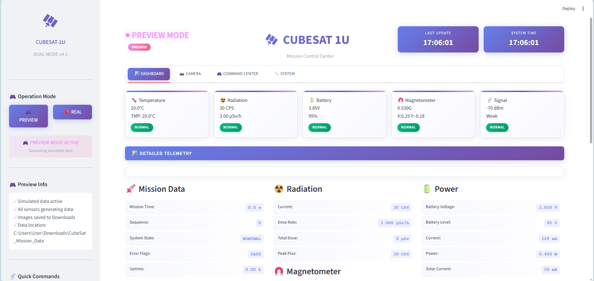

## CubeSat 1U Software Documentation

### 1. SYSTEM ARCHITECTURE
<div class="grid">
    
</div>

### 1.1 Overview
The CubeSat 1U software consists of three independent programs running on different hardware:

```
┌──────────────────┐     ┌──────────────────┐     ┌──────────────────┐
│   STM32F0        │     │  Raspberry Pi    │     │  Ground Station  │
│   (C/FreeRTOS)   │───▶│  Zero 2 W        │────▶│  (Streamlit)     │
│                  │ UART│  (Python)        │ UDP │                  │
└────────┬─────────┘     └────────┬─────────┘     └──────────────────┘
         │                        │                        │
         ▼                        ▼                        ▼
      Sensors                  Camera                    User
      • LIS3MDL                • 8MP                    • Display
      • BME280                 • SVD Comp.              • Commands
      • TMP117                 • SD Card                • Export
      • MCP3008                 
      • SBM-20
```

### 1.2 Program Responsibilities

| Program | Language | Hardware | Responsibility |
|---------|----------|----------|----------------|
| **STM32 Firmware** | C/FreeRTOS | STM32F0 | Real-time sensor reading, radiation counting, UART communication |
| **Raspberry Pi** | Python 3 | Pi Zero 2 W | Camera control, image compression, data logging, UDP communication |
| **Ground Station** | Python/Streamlit | PC | Telemetry visualization, command interface, data export |

---

###  2. HARDWARE CONFIGURATION

### 2.1 Connection Diagram

```
STM32F0                             
┌──────────────┐                     
│ PA0  ← SBM-20│                     Raspberry Pi Zero 2 W
│ PA1  → Wake  │                      ┌─────────────────┐
│ PA4  → CS    │                      │ GPIO14 (TX)     │
│ PA5  → SCK   │                      │ GPIO15 (RX) ◄───┼── UART
│ PA6  ← MISO  │                      │ GPIO17 ◄── Wake │
│ PA7  → MOSI  │                      │ GPIO22 → LED    │
│ PA9  → TX    │──────────────────────│ CSI ───► Camera │
│ PA10 ← RX    │                      │ USB ───► Radio  │
│ PB0  ← Batt  │                      └─────────────────┘
│ PB6  → SCL   │─── I2C ───► LIS3MDL, BME280, TMP117
│ PB7  → SDA   │
│ PC13 → LED   │
└──────────────┘
```

### 2.2 Pin Functions

| STM32 Pin | Function | Connection | Purpose |
|-----------|----------|------------|---------|
| PA0 | EXTI0 | SBM-20 | Radiation pulse counting |
| PA1 | GPIO_OUT | Pi GPIO17 | Wake Raspberry Pi |
| PA4 | SPI1_NSS | MCP3008 CS | Chip select for ADC |
| PA5 | SPI1_SCK | MCP3008 SCK | SPI clock |
| PA6 | SPI1_MISO | MCP3008 MISO | Data from ADC |
| PA7 | SPI1_MOSI | MCP3008 MOSI | Data to ADC |
| PA9 | USART1_TX | Pi GPIO15 | Send telemetry |
| PA10 | USART1_RX | Pi GPIO14 | Receive commands |
| PB0 | ADC_IN | Voltage divider | Battery monitoring |
| PB6 | I2C1_SCL | All I2C sensors | I2C clock |
| PB7 | I2C1_SDA | All I2C sensors | I2C data |
| PC13 | GPIO_OUT | Status LED | Heartbeat |

---


### 3.1 STM32 programm (C/FreeRTOS)
```
CubeSat-1U/
├── stm32-firmware/
│   ├── Core/
│   │   ├── Inc/
│   │   │   ├── main.h
│   │   │   ├── sensors.h
│   │   │   ├── communication.h
│   │   │   ├── stm32f4xx_hal.h
│   │   │   └── system.h
│   │   └── Src/
│   │       ├── main.c
│   │       ├── sensors.c
│   │       ├── communication.c
│   │       └── system.c
│   ├── STM32CubeMX.ioc
│   └── flash.sh
│
├── raspberry-pi-code/
│   ├── flight_controller.py
│   ├── camera_handler.py
│   ├── telemetry_handler.py
│   ├── communication.py
│   ├── test_no_hardware.py
│   ├── encoding_fix.py
│   ├── requirements.txt
│   └── install_service.sh
│
├── ground-station/
│   ├── ground_station.py
│   ├── telemetry_viewer.py
│   ├── image_viewer.py
│   ├── command_sender.py
│   └── requirements.txt
│
├── tests/
│   ├── run_all_tests_simulated.py
│   ├── test_communication_simulated.py
│   └── launch.json
│
├── vscode/
│   ├── c_cpp_properties.json
│   ├── tasks.json
│   └── launch.json
│
├── cubesat.log
├── config.json
├── ground_config.json
├── CubeSat-1U.code-workspace
└── README.md
```

### 3.2 Key Functions

### *SensorTask*
```c
void SensorTask(void *argument) {
    while(1) {
        // Read magnetometer (I2C)
        LIS3MDL_Read(&mag_x, &mag_y, &mag_z);
        
        // Read environment (I2C)
        BME280_Read(&temp, &press, &hum);
        
        // Read precision temperature (I2C)
        TMP117_Read(&temp_precise);
        
        // Read corrosion sensor (SPI)
        corrosion = MCP3008_Read(0);
        
        // Read battery voltage (ADC)
        battery = Read_Battery_Voltage();
        
        // Queue telemetry
        osMessageQueuePut(telemetryQueue, &data, 0, 0);
        
        vTaskDelay(pdMS_TO_TICKS(1000));
    }
}
```

### *Radiation Interrupt*
```c
void HAL_GPIO_EXTI_Callback(uint16_t GPIO_Pin) {
    if(GPIO_Pin == RADIATION_PIN) {
        radiation_pulse_count++;  // Increment on each pulse
    }
}
```

### *Calculations Performed*
- **Magnetometer**: Raw × 0.00016 → Gauss
- **Battery**: (ADC × 3300 × 2) / 4096 → mV
- **Radiation**: current_count - last_count → CPS

---


### 4.1 Threads

| Thread | Function |
|--------|----------|
| **STM32 Reader** | Reads UART, parses telemetry |
| **STM32 Writer** | Sends commands to STM32 |
| **Command Processor** | Executes ground commands |
| **Image Capture** | Takes photos every 10 minutes |
| **Image Compressor** | SVD compression |
| **Telemetry Logger** | SQLite database |
| **Health Monitor** | Checks disk space, temperature |
| **Downlink Manager** | UDP to ground station |

### 4.2 Key Functions

### *Telemetry Parsing*
```python
def parse_telemetry(self, data):
    return {
        'sequence': struct.unpack('<H', data[3:5])[0],
        'mag_x': struct.unpack('<f', data[9:13])[0],
        'mag_y': struct.unpack('<f', data[13:17])[0],
        'mag_z': struct.unpack('<f', data[17:21])[0],
        'corrosion_raw': struct.unpack('<H', data[21:23])[0],
        'radiation_cps': struct.unpack('<I', data[23:27])[0],
        'temperature_bme': struct.unpack('<f', data[27:31])[0],
        'pressure': struct.unpack('<f', data[31:35])[0],
        'humidity': struct.unpack('<f', data[35:39])[0],
        'battery_voltage': struct.unpack('<H', data[39:41])[0] / 1000.0
    }
```

### *SVD Image Compression*
```python
def svd_compress(self, img_array, k=50):
    # A = U × Σ × V^T
    U, s, Vt = np.linalg.svd(img_array, full_matrices=False)
    # Keep only k largest singular values
    compressed = U[:, :k] @ np.diag(s[:k]) @ Vt[:k, :]
    return compressed  # 10:1 compression ratio
```

### *Database Schema*
```sql
CREATE TABLE telemetry (
    id INTEGER PRIMARY KEY,
    timestamp REAL,
    sequence INTEGER,
    mag_x REAL, mag_y REAL, mag_z REAL,
    corrosion_raw INTEGER,
    radiation_cps INTEGER,
    temperature_bme REAL,
    pressure REAL,
    humidity REAL,
    battery_voltage REAL,
    battery_level INTEGER
);
```


###  5. COMMUNICATION PROTOCOL

### 5.1 Telemetry Packet (40 bytes)
```
0:    0xAA     - Sync byte 1
1:    0x55     - Sync byte 2  
2:    0x01     - Packet type
3-4:  uint16   - Sequence number
5-8:  uint32   - Timestamp
9-12: float    - Magnetometer X
13-16:float    - Magnetometer Y
17-20:float    - Magnetometer Z
21-22:uint16   - Corrosion raw
23-26:uint32   - Radiation CPS
27-30:float    - Temperature BME
31-34:float    - Pressure
35-38:float    - Humidity
39-40:uint16   - Battery voltage (mV)
```

### 5.2 Command Packet 
```
0:    0xAA     - Sync byte 1
1:    0x56     - Sync byte 2
2:    uint8    - Command ID
3-4:  uint16   - Sequence
5-6:  uint16   - Parameter length
7...: bytes    - Parameters (JSON)
last: uint16   - Checksum
```

###  5.3 Command IDs 
| ID | Command | Description |
|----|---------|-------------|
| 0x01 | PING | Test connection |
| 0x02 | GET_TELEMETRY | Request data |
| 0x03 | CAPTURE_IMAGE | Take photo |
| 0x04 | SET_MODE | Change mode |
| 0x05 | RESET | Reset system |
| 0x09 | BEACON | Send status |

---

### 6. DATA PROCESSING 

### 6.1 Calculations 

| Parameter | Formula | Source |
|-----------|---------|--------|
| **Magnetometer** | `raw × 0.00016` | LIS3MDL |
| **Battery Voltage** | `(ADC × 3300 × 2) / 4096` | ADC |
| **Battery Level** | `((V - 3.4) / 0.8) × 100` | Derived |
| **Radiation CPS** | `count - last_count` | SBM-20 |
| **Dose Rate** | `CPS × 0.1` | Derived |
| **Mag Strength** | `√(x² + y² + z²)` | Derived |
| **SVD Compression** | `U[:,:k] × Σ[:k,:k] × Vᵀ[:k,:]` | Image |

### 6.2 Data Flow

```
Sensors → STM32 → UART → Raspberry Pi → UDP → Ground Station
   │          │           │              │           │
   ▼          ▼           ▼              ▼           ▼
 Analog    Packets     Database       Network     Display
 Values    (40 bytes)  (SQLite)       (Port 5001) (Graphs)
```

---

### 7. SOFTWARE STACK & DEPENDENCIES

### 7.1 STM32 Development

| Component | Version | Purpose |
|-----------|---------|---------|
| **STM32CubeIDE** | 1.13.0 | IDE and code generation |
| **STM32 HAL** | 1.11.0 | Hardware abstraction layer |
| **FreeRTOS** | 10.3.1 | Real-time operating system |
| **ARM GCC** | 10.3.1 | Compiler |
| **Make** | 4.3 | Build system |

### 7.2 Raspberry Pi Python Packages

| Package | Version | Purpose |
|---------|---------|---------|
| **Python** | 3.9+ | Runtime |
| **pyserial** | 3.5 | UART communication |
| **RPi.GPIO** | 0.7.0 | GPIO control |
| **numpy** | 1.24.3 | SVD compression |
| **opencv-python** | 4.8.1 | Camera capture |
| **Pillow** | 10.0.1 | Image processing |
| **sqlite3** | built-in | Database |

### 7.3 Ground Station Python Packages

| Package | Version | Purpose |
|---------|---------|---------|
| **streamlit** | 1.28.0 | Web UI framework |
| **plotly** | 5.17.0 | Interactive graphs |
| **pandas** | 2.1.0 | Data manipulation |
| **numpy** | 1.24.3 | Numerical operations |
| **pyserial** | 3.5 | Serial communication (optional) |

### 7.4 Installation Commands

### *Raspberry Pi*
```bash
sudo apt update
sudo apt install python3-pip python3-opencv
pip3 install pyserial RPi.GPIO numpy Pillow
```

### *Ground Station (Windows/PC)*
```bash
pip install streamlit plotly pandas numpy pyserial
```

### SUMMARY
---

### What Each Program Does:

| Program | Input | Processing | Output |
|---------|-------|------------|--------|
| **STM32** | Sensor signals (I2C/SPI/ADC) | Real-time reading, counting | 40-byte packets via UART |
| **Raspberry Pi** | UART data, Camera | Parsing, SVD compression, DB | UDP packets |
| **Ground Station** | UDP packets | Visualization, commands | Graphs, exports |

### Key Calculations:
- Magnetometer: Raw × 0.00016 → Gauss
- Battery: ADC → mV → percentage
- Radiation: Pulse count → CPS → dose rate
- Image: SVD with k=50 → 10:1 compression

### Communication:
- **STM32 ↔ Pi**: UART @ 115200 baud
- **Pi ↔ Ground**: UDP port 5001

### Dependencies:
- **STM32**: STM32CubeIDE, HAL, FreeRTOS
- **Pi**: pyserial, RPi.GPIO, numpy, opencv
- **Ground**: streamlit, plotly, pandas


